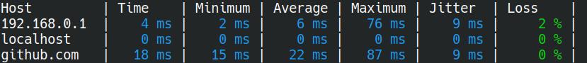

`multiping` is a TUI utility to ping and see statistics on multiple hosts at the same time.

## Features
* Written in Rust.
* IPv4 and IPv6 support
* Specify hosts by IP address or domain name
* Shows the latest, minimum, average and maximum times, jitter and proportion of lost packets

## Screenshot

Inspired by [icmp_watch](https://github.com/stolk/icmp_watch)
